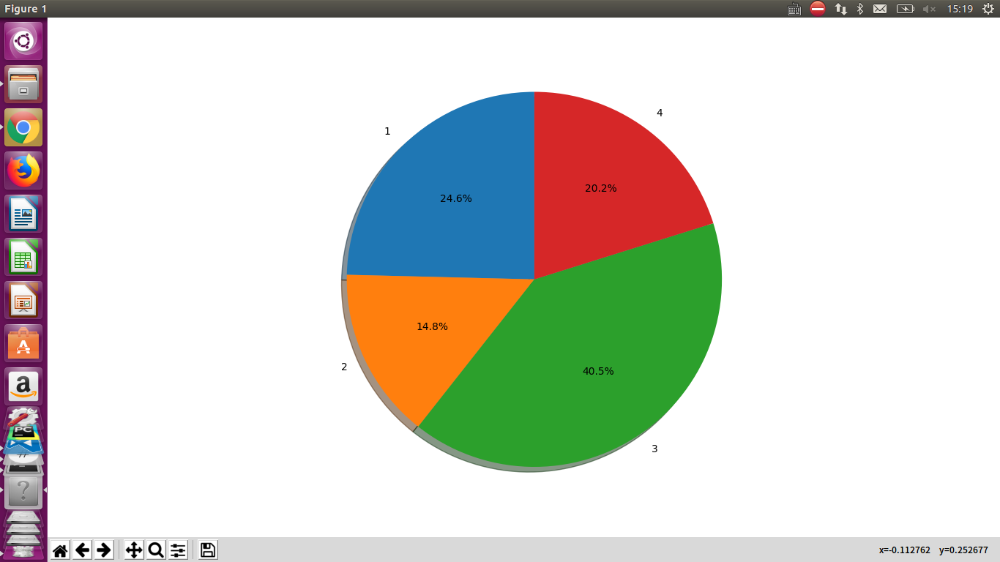
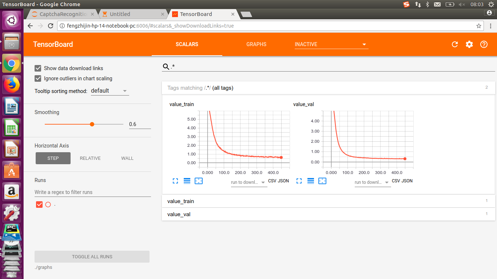

### 数据分布
<table>
   <tr><td>训练集数量:</td><td>32000</td><td>验证集数量:</td><td>4000</td><td>测试集数量:</td><td>4000</td></tr>
   <tr><td>一位数验证码:</td><td>9844</td><td>二位数验证码:</td><td>5908</td><td>三位数验证码:</td><td>16183</td></tr>
   <tr><td>四位数位数验证码:</td><td>8065</td></tr>
</table>

### [CNN模型]()
- #### 网络结构
    - 第一层为以relu为激活函数的卷积与平均池化，padding='SAME'。
    - 第二层为以relu为激活函数的卷积与平均池化，padding='SAME'。
    - 第三层为以relu为激活函数的卷积与平均池化，padding='SAME'。
    - 第四层拥有4个分支，每个分支都是以relu为激活函数的卷积与平均池化，padding='SAME'。
    - 第五层拥有4个分支，每个分支都是以relu为激活函数的卷积，padding='SAME'。
    - 第六层拥有4个分支，每个分支都是以relu为激活函数的全连接层。
    - 第七层拥有4个分支，每个分支都是全连接输出层
- #### 优化函数为Adam
- #### 参数数量：2418316
- #### Tensorboard可视化
  
  